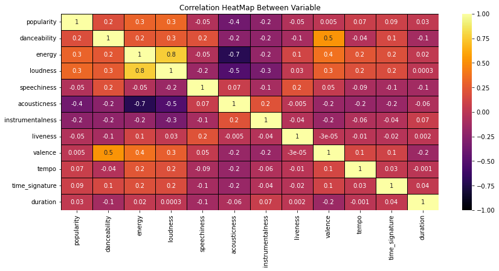
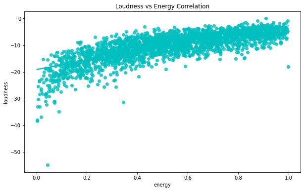
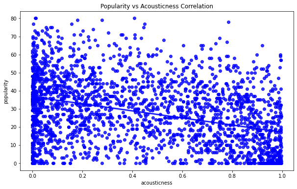
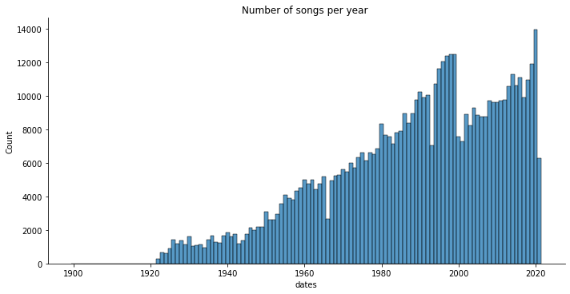
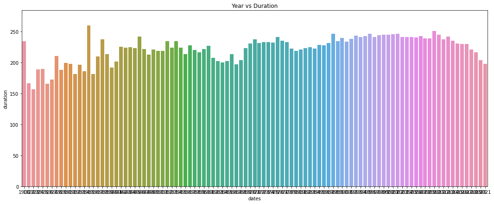

# Spotify Music Data Analysis using Python and Visualization
  

## Project Overview
This project involves analyzing a dataset of Spotify tracks to uncover trends and patterns using Python's data analysis and visualization tools. The goal is to gain insights into how music has evolved over time, such as changes in track duration, genre popularity, and other key features.

## Motivation
Spotify, with its vast catalog of tracks, provides a rich source of data for understanding the music industry. By exploring this data, we aim to uncover insights that could help artists, listeners, and industry stakeholders make data-driven decisions. This project focuses on analyzing track metadata to identify interesting patterns in the music available on Spotify.

## Dataset
The dataset used for this analysis is sourced from Kaggle and can be found [here](https://www.kaggle.com/datasets/zaheenhamidani/ultimate-spotify-tracks-db). The dataset contains over 600,000 tracks along with metadata such as:

- Track Name
- Artist
- Album
- Duration (ms)
- Year of Release
- Genres
- Popularity

## Libraries and Tools Used
- **pandas** for data manipulation
- **matplotlib** and **seaborn** for data visualization
- **numpy** for numerical computations
- **Jupyter Notebook** for running the analysis

## Exploratory Data Analysis (EDA)
The core part of this project is performing EDA to understand relationships within the dataset, such as:

- **Track Duration over the Years:** Analyzing how the average duration of songs has changed.
- **Genre Popularity:** Exploring which genres have remained popular and which have declined.
- **Song Length Distribution:** Examining the distribution of track lengths to find out what is the common track length on Spotify.

### Key Visualizations

#### Correlation Between Variables 
 
 
#### Loudness vs Energy Correlation
  

#### Popularity vs Acousticness Correlation
  

#### Number of Songs per year
  

#### Year vs Duration
  

## Insights
Here are some key insights from the analysis:

- **Song Length Over Time:** There is a noticeable change in the average duration of songs, with possible fluctuations based on listener preferences and streaming trends.
- **Genre Trends:** Certain genres have gained or lost popularity over time, showing shifts in musical tastes.
- **Track Duration Distribution:** A significant number of popular tracks tend to fall within a specific duration range, highlighting the potential impact of song length on popularity.

## Conclusion
Through this project, we explored various aspects of the Spotify dataset, revealing patterns that could help in understanding trends in the music industry. These insights can be useful for artists, record labels, and Spotify itself to better tailor their offerings to listener preferences.

## References
- Dataset: [Ultimate Spotify Tracks Database](https://www.kaggle.com/datasets/zaheenhamidani/ultimate-spotify-tracks-db)

